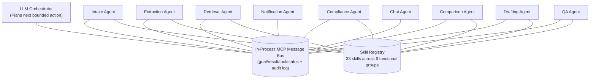

# Agentic AI Workflow for IT Services Document Processing, Compliance Review, and Proposal Drafting

## Abstract
Government IT service bids require rapid, high-stakes compliance review between statement-of-work (SOW) requirements and vendor proposal evidence. This project implements a domain-specific multi-agent MCP system that automates that workflow with transparent decision traces. The system combines 10 role-based agents at the application layer (8 runtime workflow agents plus 2 stakeholder-facing agents), a 33-skill registry, and an LLM-driven orchestrator that plans one bounded action at a time from a fixed nine-action vocabulary. The orchestrator repeatedly summarizes workflow state (completed steps, requirement/decision counts, confidence ranges, and action history), selects the next action, executes it through specialized agents, updates state, and continues until QA and finalization. Retrieval uses hybrid evidence search (BM25 lexical + cosine semantic), while compliance reasoning applies a four-label rubric (`compliant`, `partial`, `not_compliant`, `not_addressed`) with citation validation and confidence calibration. On the primary IT services scenario (15 labeled requirements), the system achieved 73.3% accuracy, Cohen's kappa of 0.597, and ECE of 0.138 with an 8-step LLM-planned trace. On a 3-requirement baseline scenario, it achieved 100% accuracy, kappa of 1.000, and ECE of 0.234 with a 9-step LLM-planned trace. A deterministic no-LLM fallback path produced decisions but substantially lower accuracy in a controlled fallback run, confirming the value of LLM-backed reasoning for nuanced compliance judgments. These results show that multi-agent, planner-driven architectures can reduce multi-day manual compliance review cycles while preserving auditability through observable agent communication and planning history.

## I. Introduction
IT services companies pursuing government contracts must quickly validate whether proposal text satisfies detailed SOW obligations. This review is usually manual, deadline-driven, and vulnerable to inconsistency, especially when requirements contain conditional clauses, time-bound service levels, and security language. Missed obligations can lead to non-compliant submissions, while over-conservative interpretations can trigger costly rewrite loops late in the proposal cycle.

A single-pass LLM call is often insufficient for this task because compliance review is not one operation; it is a staged process involving ingestion, requirement extraction, evidence retrieval, reasoning, quality checks, and often iterative reanalysis. Each stage benefits from specialized behavior and intermediate-state awareness. The core engineering problem is therefore orchestration: deciding what to do next based on current evidence quality and workflow status.

This work presents a multi-agent MCP architecture for IT services compliance analysis. The system uses role-specialized agents coordinated by an LLM-driven orchestrator that plans within a bounded action space, tracks retries, and explicitly handles diminishing returns. The design prioritizes both automation and transparency by preserving complete planning traces, agent messages, and citation-linked decisions.

The main contributions are:

1. A domain-specific multi-agent architecture for SOW-proposal compliance review and proposal support.
2. An LLM-driven planner with a bounded action vocabulary, retry caps, and diminishing-returns awareness.
3. A hybrid retrieval strategy combining BM25 lexical matching with cosine semantic scoring and per-requirement weighting.
4. A stakeholder-facing observability layer with auditable decision traces, confidence signals, and agent activity history.

## II. Related Work / Literature Review
Recent work on LLM multi-agent systems shows that collaborative agent patterns can improve decomposition and task handling for complex workflows. AutoGen formalized conversational multi-agent coordination patterns for tool-augmented tasks [1], while CAMEL explored role-playing cooperative agents for autonomous task completion [2]. These systems are general-purpose and motivate role specialization, but they do not directly target contract compliance operations.

Planning-oriented LLM agent research has emphasized reasoning-action loops and tool use. ReAct introduced interleaved reasoning and acting trajectories [3], Toolformer demonstrated self-supervised tool-use behavior [4], and HuggingGPT coordinated model/tool selection through a central controller [5]. Our approach adapts this line of work by restricting planning to a bounded enterprise-safe action vocabulary rather than unconstrained action generation.

For retrieval-augmented pipelines, RAG established the value of retrieval-grounded generation for knowledge-intensive tasks [6]. Hybrid sparse-dense retrieval remains effective in document-heavy settings, combining exact lexical relevance (e.g., BM25 [7]) with semantic similarity. Compliance review is particularly sensitive to this balance because obligation text often contains both exact terms (deadlines, clauses, acronyms) and paraphrased evidence.

Contract and legal NLP literature also motivates structured compliance support. ContractNLI introduced document-level entailment challenges for contractual text [8], and earlier work extracted rights/obligations from regulatory language [9]. These findings align with the need for explicit requirement-level labeling and citation-backed justifications.

Finally, agent evaluation work such as AgentBench highlights the importance of measuring not only final outputs but also process capabilities [10]. In that spirit, this project evaluates both outcome quality and planner behavior through step traces, retry patterns, and confidence calibration.

The key gap in prior work is domain grounding. Existing frameworks (e.g., AutoGen, CAMEL, LangGraph-style orchestration) are general infrastructure, whereas this system contributes a compliance-focused instantiation with bounded planning, retrieval tailoring, and stakeholder-facing audit visibility.

## III. Methodology
### A. System Architecture
The system follows an in-process MCP hub-and-spoke design. Agents exchange structured messages (`goal`, `result`, `tool_call`, `tool_result`, `status`, `error`) over a shared bus, and all traffic is persisted into an audit log for traceability.

At the application level, the solution models 10 agents:

1. `orchestrator`
2. `intake_agent`
3. `extraction_agent`
4. `retrieval_agent`
5. `compliance_agent`
6. `comparison_agent`
7. `drafting_agent`
8. `qa_agent`
9. `notification_agent`
10. `chat_agent`

The core compliance execution loop currently instantiates the first 8 agents at runtime, while notification and chat agents are used in the stakeholder operations layer.

The skill registry exposes 33 skills organized by function (document processing, requirement analysis, retrieval, reasoning, comparison/drafting, and QA). This separates coordination from execution: the orchestrator decides *what* to do next, while specialist agents execute *how* using skills.

**Figure 1. System architecture (orchestrator-centered MCP design).**

### B. LLM-Driven Orchestration
The orchestrator runs a planning loop:

1. Build a state summary.
2. Ask the planner LLM for the next action.
3. Execute the chosen action via the appropriate agent.
4. Update state (steps, outputs, confidence, retry counters).
5. Repeat until `finalize`.

The bounded action vocabulary contains nine actions:

1. `dispatch_intake`
2. `dispatch_extraction`
3. `dispatch_retrieval`
4. `dispatch_compliance`
5. `dispatch_comparison`
6. `dispatch_drafting`
7. `dispatch_qa`
8. `request_reanalysis`
9. `finalize`

Planner inputs include completed steps, requirement/evidence/decision counts, confidence range, low-confidence requirement IDs, action attempt counts, and recent action history. The planner is instructed to avoid unproductive loops and to treat persistent low confidence as a potentially valid finding when evidence is genuinely weak.

Two control safeguards are central:

1. **Retry cap:** max 2 attempts per action (except terminal logic).
2. **Diminishing-returns policy:** after bounded retrieval/reanalysis attempts, advance to QA and finalize rather than looping.

If planner LLM calls fail, the orchestrator applies deterministic fallback sequencing based on workflow state.

### C. Compliance Analysis Pipeline
**Intake.** Documents (PDF/DOCX/TXT) are parsed, section headers are detected heuristically, metadata is preserved, and text is chunked with sentence-aware token windows and overlap.

**Extraction.** Requirements are identified using an adaptive strategy selector (`lexical`, `llm`, or `hybrid`) based on document structure and noise indicators. Output requirements are deduplicated and assigned canonical IDs.

**Retrieval.** Evidence retrieval combines:

1. BM25 lexical ranking for exact obligation matching.
2. Cosine similarity over token vectors for semantic coverage.
3. Weighted reranking (semantic/lexical weights can shift per requirement type).
4. Query expansion (acronyms, numeric constraints, and domain term expansions).

**Compliance assessment.** For each requirement, the compliance agent applies a 4-label rubric (`compliant`, `partial`, `not_compliant`, `not_addressed`) using LLM-backed reasoning (DeepInfra-hosted Meta-Llama-3.1-70B-Instruct in the primary runs), then validates citation IDs and applies confidence penalties for unsupported or invalid citations.

**QA.** QA checks include placeholder detection, formatting checks, requirement coverage checks, and approval gating for flagged low-confidence findings.

### D. Evaluation Methodology
Ground truth labels were manually defined for two scenarios:

1. IT services SOW scenario: 15 requirements (`it_services_compliance_02`).
2. Basic compliance scenario: 3 requirements (`compliance_review_case_01`).

Primary metrics:

1. Accuracy.
2. Cohen's kappa.
3. Per-label precision/recall/F1.
4. Expected calibration error (ECE).

All reported primary-run decisions were tagged with `execution_mode = "llm"`. A controlled no-LLM run (`execution_mode = "fallback_rules"`) was used to compare against deterministic fallback behavior.

## IV. Implementation
The implementation stack uses Python with modular agent/skill components and FastAPI for the stakeholder workspace. Key system components are:

1. **Core runtime:** in-process MCP bus, agent cards, message protocol, and audit logging.
2. **Orchestration:** LLM planner (Gemma 3 27B via DeepInfra endpoint) plus deterministic fallback policy.
3. **Reasoning:** Meta-Llama-3.1-70B-Instruct for compliance judgments in primary runs.
4. **Dashboard:** FastAPI + Jinja2 + static JS/CSS for contract lifecycle views, run-level traces, live progress pages, notification surfacing, and chat assistant queries grounded in run artifacts.
5. **Document corpus:** structured scenario library mirroring enterprise folders (contracts, governance, operations, security, staffing, finance, incidents, and changes).

The project is deployment-ready through Docker (`Dockerfile` + `render.yaml`) and environment-based configuration. Degradation behavior is explicit: if planner or reasoning models are unavailable, the system falls back to deterministic control and rules-based compliance scoring instead of failing closed.

Testing coverage spans agent behavior, orchestrator logic, retrieval, parsing/chunking, and end-to-end scenario execution. The broader project validation plan targets 47 automated checks across modules and workflows.

## V. Results and Discussion
### A. Quantitative Results
Evaluation was performed on runs generated on April 13, 2026:

- 15-requirement run: `CTR-2026-004_compliance_review`.
- 3-requirement run: `CTR-2026-006_final_review`.

**Table I. Cross-scenario evaluation summary.**

| Scenario | Requirements | Accuracy | Cohen's κ | ECE | Planning Steps | Planner Mode |
|---|---:|---:|---:|---:|---:|---|
| IT Services SOW (15 req) | 15 | 73.3% | 0.597 | 0.138 | 8 | LLM |
| Basic Compliance (3 req) | 3 | 100% | 1.000 | 0.234 | 9 | LLM |

### B. Planning Behavior Analysis
The 8-step planning trace for the IT services scenario shows adaptive control rather than fixed linear execution.

**Table II. IT services planning trace (8-step LLM plan).**

| Step | Action | Planner Intent |
|---:|---|---|
| 1 | intake | Parse and prepare documents |
| 2 | extraction | Extract atomic requirements |
| 3 | retrieval | Gather initial evidence |
| 4 | compliance | Produce first compliance decisions |
| 5 | retrieval (targeted retry) | Improve low-confidence requirements |
| 6 | reanalysis | Reassess unresolved low-confidence items |
| 7 | QA | Gate outputs and review queue |
| 8 | finalize | Stop after diminishing returns and export artifacts |

The key adaptive behavior occurred at steps 5-7: the orchestrator retried retrieval, requested reanalysis for targeted IDs, then advanced to QA once further retries were unlikely to improve confidence.

### C. Error Analysis
The IT services scenario had 4 misclassifications out of 15.

**Table III. Per-requirement outcome breakdown (IT services scenario).**

| Requirement | Ground Truth | Predicted | Correct |
|---|---|---|---|
| REQ_0001 | compliant | compliant | ✅ |
| REQ_0002 | compliant | partial | ❌ |
| REQ_0003 | compliant | compliant | ✅ |
| REQ_0004 | partial | partial | ✅ |
| REQ_0005 | compliant | compliant | ✅ |
| REQ_0006 | partial | partial | ✅ |
| REQ_0007 | compliant | partial | ❌ |
| REQ_0008 | compliant | partial | ❌ |
| REQ_0009 | partial | partial | ✅ |
| REQ_0010 | not_addressed | not_addressed | ✅ |
| REQ_0011 | compliant | compliant | ✅ |
| REQ_0012 | not_addressed | not_addressed | ✅ |
| REQ_0013 | compliant | compliant | ✅ |
| REQ_0014 | partial | not_addressed | ❌ |
| REQ_0015 | not_addressed | not_addressed | ✅ |

Three errors (REQ_0002, REQ_0007, REQ_0008) were conservative `partial` predictions where ground truth was `compliant`. One error (REQ_0014) was a miss (`not_addressed` vs `partial`). This pattern indicates conservative bias: the system tends to flag incomplete explicitness rather than over-credit implied coverage.

### D. LLM vs Fallback Comparison
In the two primary benchmark runs, all decisions were LLM-backed (`execution_mode = "llm"`). To test robustness, a controlled no-LLM run on the 3-requirement scenario (`fallback_basic_check`) forced deterministic fallback (`execution_mode = "fallback_rules"`) and produced:

1. Accuracy: 33.3%
2. Cohen's κ: -0.50
3. ECE: 0.387

This gap supports the claim that LLM-backed reasoning materially improves nuanced compliance judgments over heuristics-only fallback.

## VI. Limitations and Future Work
### A. Current Limitations
1. **Hub-and-spoke control:** agents do not negotiate directly; all coordination routes through orchestrator-mediated sequencing.
2. **Skill invocation path:** skills are invoked via in-process registry calls (with audit events), not fully as peer MCP tool endpoints.
3. **Retrieval persistence:** current workflow relies on in-memory retrieval context; production would require persistent vector indexing.
4. **Evaluation scale:** current benchmark set is limited (15 + 3 requirements), so variance and domain shift are under-sampled.
5. **Provider dependency:** primary reasoning/planning relies on one hosted provider path; production resilience needs multi-provider failover.

### B. Future Work
1. Persistent cross-run memory for agent context retention (e.g., Honcho-style memory layer).
2. Direct SAM.gov integration for live opportunity discovery and ingestion.
3. Peer-to-peer agent negotiation for contested evidence and disagreement resolution.
4. Domain fine-tuning for compliance-specific reasoning calibration.
5. Human-in-the-loop adjudication workflows with explicit approval/audit checkpoints.

## VII. Conclusion
This project delivered a transparent multi-agent compliance workflow for IT services bidding contexts, combining bounded LLM planning, hybrid retrieval, and requirement-level compliance reasoning with citation validation. Across two benchmark scenarios, the system achieved strong practical results, including 73.3% accuracy on a realistic 15-requirement case and 100% on a 3-requirement baseline, while preserving full planning and communication traces for stakeholder review. The evidence indicates that bounded multi-agent orchestration is a practical architecture for automating high-effort compliance analysis tasks without sacrificing auditability.

The system demonstrates that multi-agent architectures with LLM-driven planning can automate complex document analysis workflows while maintaining transparency and explainability through observable decision traces.

## References
[1] Q. Wu et al., “AutoGen: Enabling next-gen LLM applications via multi-agent conversation,” arXiv:2308.08155, 2023. [Online]. Available: https://arxiv.org/abs/2308.08155

[2] G. Li et al., “CAMEL: Communicative agents for ‘mind’ exploration of large language model society,” arXiv:2303.17760, 2023. [Online]. Available: https://arxiv.org/abs/2303.17760

[3] S. Yao et al., “ReAct: Synergizing reasoning and acting in language models,” arXiv:2210.03629, 2022. [Online]. Available: https://arxiv.org/abs/2210.03629

[4] T. Schick et al., “Toolformer: Language models can teach themselves to use tools,” arXiv:2302.04761, 2023. [Online]. Available: https://arxiv.org/abs/2302.04761

[5] Y. Shen et al., “HuggingGPT: Solving AI tasks with ChatGPT and its friends in Hugging Face,” arXiv:2303.17580, 2023. [Online]. Available: https://arxiv.org/abs/2303.17580

[6] P. Lewis et al., “Retrieval-augmented generation for knowledge-intensive NLP tasks,” in *Advances in Neural Information Processing Systems*, vol. 33, 2020, pp. 9459-9474. [Online]. Available: https://arxiv.org/abs/2005.11401

[7] S. Robertson and H. Zaragoza, “The probabilistic relevance framework: BM25 and beyond,” *Foundations and Trends in Information Retrieval*, vol. 3, no. 4, pp. 333-389, 2009.

[8] Y. Koreeda and C. D. Manning, “ContractNLI: A dataset for document-level natural language inference for contracts,” in *Findings of EMNLP*, 2021. [Online]. Available: https://arxiv.org/abs/2110.01799

[9] N. Kiyavitskaya, N. Zannone, L. Rapanotti, and D. C. Gause, “Extracting rights and obligations from regulations: Toward a tool-supported process,” in *Proc. IEEE AINA*, 2008, pp. 997-1004.

[10] X. Liu et al., “AgentBench: Evaluating LLMs as agents,” arXiv:2308.03688, 2023. [Online]. Available: https://arxiv.org/abs/2308.03688

[11] J. Cohen, “A coefficient of agreement for nominal scales,” *Educational and Psychological Measurement*, vol. 20, no. 1, pp. 37-46, 1960.

[12] C. Guo, G. Pleiss, Y. Sun, and K. Q. Weinberger, “On calibration of modern neural networks,” in *Proc. ICML*, 2017, pp. 1321-1330.
